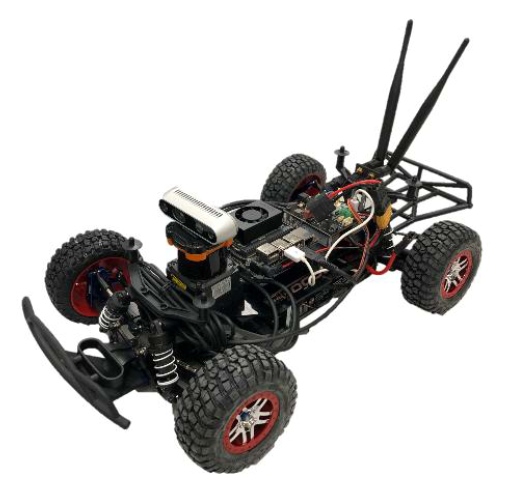

# RoboRacer-Shiran – Autonomy Technology Team Project

  
   
  <em>RoboRacer autonomous racing platform used in the Autonomy Technology team project</em>

## 📌 Overview

This repository contains the team project for the **Autonomy Technology** study program.The goal of this project is to design, implement, and evaluate a **full autonomous driving stack**
for a scaled racing vehicle as part of the **RoboRacer Challenge**.
The system covers the complete autonomy pipeline:
**Perception, Estimation, Planning, and Control**, developed and integrated by the team.

## 🏎️ RoboRacer Platform

RoboRacer is an autonomous racing platform that challenges teams to operate a vehicle
**without human fallback**, under high-speed and competitive conditions.

🔗 Official platform: https://roboracer.ai/

## 🎯 Project Objectives

- Develop a complete autonomous driving stack
- Test and validate the system in simulation
- Deploy and evaluate the system on the real RoboRacer platform
- Compete against other teams on the racing track

## 🧠 System Architecture

The project is structured into the following core modules:

- **Perception**

  - Environment modeling
  - Sensor data processing

- **Estimation**

  - Vehicle localization
  - State estimation and uncertainty handling

- **Planning**

  - Trajectory generation
  - Decision-making and optimization

- **Control**
  - Motion control
  - Stability and trajectory tracking

Each module is developed independently and integrated into a full-stack autonomous system.

## 👥 Team Members

| Name                             | Responsibility                   |
| -------------------------------- | -------------------------------- |
| Mohammadsadegh Shoushtaridehshal | Team Lead / Autonomy Integration |
| Farhad Vaseghi                   | Perception                       |
| Milad Bahari Qaragoz             | Estimation                       |
| Kazhal Shirvani                  | Planning                         |
| Mohammad Barabadi                | Control                          |

## 🛠️ Technologies

- Python / C++
- ROS 2
- Simulation tools
- Autonomous driving algorithms

## 📂 Repository Structure
